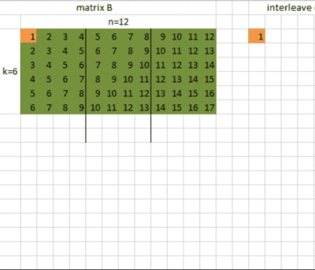
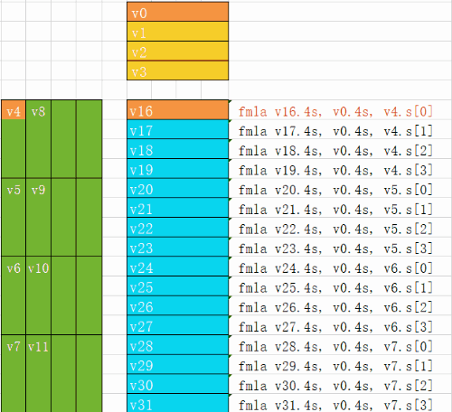

[English Version](readme.md)

# 基于ARM-v8的Tengine GEMM教程
@author: Chunying

## GEMM简介
什么是GEMM? 它的英文全称是 GEneral Matrix to Matrix Multiplication (通用矩阵的矩阵乘法). GEMM在神经网络的计算中占据很重要的位置。这里有一篇文章[Why gemm is at the heart of deep learning](https://petewarden.com/2015/04/20/why-gemm-is-at-the-heart-of-deep-learning/) 介绍了为什么GEMM在深度学习计算中占据重要位置，以及卷积计算中是如何使用GEMM的。

## 教程大纲
这篇教程分为三部分:
- [Step1: 纯C实现的GEMM](#step1-gemm-with-pure-c-code)

    这部分主要介绍GEMM的一些基本概念和记号 (A,B,C,m,n,k)，并且介绍了实现过程中用到的一些工具函数，在文件`gemm_utils.h`中. 
- [Step2: 调用OpenBLAS的GEMM](#step2-gemm-with-openblas)
  
    这部分调用Openblas库的`cblas_sgemm`函数，并比较了openblas和纯C实习的矩阵乘法在 3399上单核A53的性能，并比较了两种实现的输出结果。

- [Step3: Tengine中的GEMM](#step3-gemm-with-tengine-16x4-kernel)

    这部分介绍了Tengine中用到的GEMM的4X16 kernel实现。

运行这个教程的代码，你需要：
- 可以执行armv8汇编的环境，比如**RK3399**
- linux操作系统: 本教程的编译脚本使用的是Makefile (其他操作系统读者可自行写编译脚本)
  
## Step1: GEMM with Pure C Code
我们首先执行 step1部分的代码，看看程序输出结果，然后我们再解释这部分的具体实现。

到step1目录下，直接make,然后运行测试程序
```bash
cd step1
make
./test
```
可以看到输出结果为：
```c
A=
3.000000 2.000000 1.000000 3.000000
1.000000 3.000000 2.000000 0.000000
1.000000 1.000000 2.000000 3.000000
2.000000 3.000000 3.000000 2.000000
================
B=
3.000000 2.000000 1.000000 3.000000
1.000000 3.000000 2.000000 0.000000
1.000000 1.000000 2.000000 3.000000
2.000000 3.000000 3.000000 2.000000
================
C=
18.000000 22.000000 18.000000 18.000000
8.000000 13.000000 11.000000 9.000000
12.000000 16.000000 16.000000 15.000000
16.000000 22.000000 20.000000 19.000000
================
```
这个程序中我们计算的矩阵乘法是 A(m,k) * B(k,n) =C(m,n)：
* A 是第一个输入矩阵
  * m 是矩阵A的行数
  * k 是矩阵A的列数
* B 是第二个输入矩阵
  * k 是矩阵B的行数
  * n 是矩阵B的列数
* C 是输出矩阵
  * m 是矩阵C的行数
  * n 是矩阵C的列数
  


我们调用头文件 `gemm_utils.h`中的初始化函数`init`来为三个矩阵申请内存并初始化：
```c
    float* A    =  init(m*k,3);
    float* B    =  init(n*k,3);
    float* C    =  init(m*n,0);
```
矩阵乘法的纯C实现如下:
```c
void gemm_pure_c(float* A, float* B, float* C,int m,int n,int k)
{
    for(int i=0;i<m;i++)
    {
        for(int j=0;j<n;j++)
        {
            C[i*n+j]=0.f;
            for(int p=0;p<k;p++)
            {
                C[i*n+j]+=A[i*k+p]*B[p*n+j];
            }
        }
    }
}
```
调用这个函数
```c
    gemm_pure_c(A,B,C,m,n,k);
```
打印出A,B,C三个矩阵的元素.：
```
    printf("A=\n");printM(A,m,k);
    printf("B=\n");printM(B,k,n);
    printf("C=\n");printM(C,m,n);
```
你可以根据A,B矩阵的值，手算出矩阵C的结果，然后再和程序的结果进行比较，看看结果是否一致。

## Step2: GEMM with OpenBLAS
### 什么是OpenBLAS?

[OpenBLAS](https://www.openblas.net/) 是一个开源的BLAS(Basic Linear Algebra Subprograms基础线性代数)计算库，在不同的处理器上都做了优化。 

### 如何安装OpenBLAS?

在Linux上，可以直接通过apt-get安装这个库:
> sudo apt-get install libopenblas-dev

### 如何运行step2代码?

```bash
cd step2
make
export OMP_NUM_THREADS=1
taskset 0x1 ./test
```
可以得到的结果是:
```
[m n k]:        256 128 256
[openblas]:     4.68 ms
[pure c]:       32.22 ms
[blas VS pure_C]:  maxerr=0.000076
```
这个例子中，我们只看单核心的性能，在RK3399板子上，我们看单个A53的性能

* Openblas是通过OMP来进行多线程加速，我们首先将OMP设置线程数为1： 
    > export OMP_NUM_THREADS=1
* 用 `taskset`绑定cpu核心(编号为0x1的cpu):
    > taskset 0x1 ./test

从耗时统计上看，计算相同尺寸的矩阵乘法，调用OpenBLAS库的性能明显优于纯C实现。同时我们也计算了这两种实现的输出的结果的误差，以验证实现的正确性。

进行矩阵乘法运算调用的是OpenBLAS库中的 `cblas_sgemm`，需要包含头文件`<cblas.h>`, 在编译时要加上`-lopenblas`选项。
```c
#include <cblas.h>
void gemm_blas(float* A,float* B,float* C,int m,int n,int k)
{
    // C=alpha*A*B+beta*C 
    int alpha =1;
    int beta = 0;
    cblas_sgemm(CblasRowMajor, 
                CblasNoTrans, CblasNoTrans, 
                m, n, k, 
                alpha, 
                A, k,
                B, n, 
                beta, 
                C, n);
}
```
在时间统计方面,我们重复计算了50次，取平均时间:
```c
    int rep = 50;
    struct timeval t0, t1;

    gettimeofday(&t0, NULL);
    for(int i = 0; i < rep; i++)
        gemm_blas(A,B,C1,m,n,k);
    gettimeofday(&t1, NULL);
    
    float blas_time = ( float )((t1.tv_sec * 1000000 + t1.tv_usec) - (t0.tv_sec * 1000000 + t0.tv_usec)) / 1000;
    printf("[openblas]:\t%.2f ms\n", blas_time / rep);
```
## Step3: GEMM with Tengine 16x4 kernel
我们首先在RK3399上执行这部分代码，看看在RK3399的1A53的性能, 然后我们再详细解释Tengine 4x16 kernel的具体实现。
```bash
cd step3
make
export OMP_NUM_THREADS=1
taskset 0x1 ./test
```
运行完上述命令，可以得到：
```
[m n k]:        256 256 256
[tengine 4x16]: 7.71 ms
[openblas]:     9.55 ms
[pure c]:       316.00 ms
[blas VS tengine]:  maxerr=0.000061
```
可以看出Tengine 4x16 kernel在这三种实现中获得最好的性能。下面将介绍Tengine 4x16 kernel的具体实现。

这部分教程以 [Tengine](https://github.com/OAID/Tengine)源码中的 [sgemm_4x16_interleave.S](https://github.com/OAID/Tengine/blob/master/executor/operator/arm64/conv/sgemm_4x16_interleave.S) 为例子，我们对汇编代码做了一些简化，只支持k是4的倍数的情况。

**Interleave**

在使用Tengine的4x16 kernel之前, 首先要对矩阵A和矩阵B的数据进行interleave。什么是interleave呢？Interleave叫交错排布，表示对数据进行重新排布，为了在计算读取数据的时候能更好地利用缓存。

Tengine 4x16 kernel中, 我门对矩阵 A的数据是对m中的每16个元素进行重排, 对矩阵B的数据是对n的每4个元素进行重排。 
这是矩阵B数据重排的C代码：
```c
void interleave_B4(float* src,float* dst,int n,int k)
{
    float* ptr = dst;
    for(int i=0;i< n;i+=4)
    {
        for(int j=0;j<k;j++)
        {
            for(int p=0;p<4;p++)
            {
                *ptr = src[j*n+ i+p];
                ptr++;
            }
        }
    }
}
```
下面这个动图展示了矩阵B的数据重排：



这是矩阵A数据重排的C代码：
```c
void interleave_A16(float* src,float* dst,int m,int k)
{
    float* ptr = dst;
    for(int i=0;i< m;i+=16)
    {
        for(int j=0;j<k;j++)
        {
            for(int p=0;p<16;p++)
            {
                *ptr = src[(i+p)*k +j];
                ptr++;
            }
        }
    }
}
```

**tengine_4x16_kernel**

Tengine的4x16 kernel计算的n=4,m=16的情况，目前支持的k是4的倍数：

$$A[16, k] \times B[k,4] = C[16,4]$$

我们在`loop4`计算k的每四个元素：
* 加载B的数据到寄存器 `v0,v1,v2,v3`
* 加载A的数据到寄存器 `v4,v5,v6,v7,v8,v9,v10,v11`

```ASM
	ldr	q0, [x1]	
	ldr	q1, [x1, 0x10]	
	ldp	q2, q3, [x1, 0x20]

	ldp	q4, q5, [x2]
	ldp	q6, q7, [x2, 0x20]		
	ldp	q8, q9, [x2, 0x40]
	ldp	q10,q11,[x2, 0x60]
```
下面的动图演示了4x16的kernel的每条指令是如何进行计算的



把输出数据保存：
```
	stp     q16, q17 ,[x0]
	stp     q18, q19 ,[x0, #0x20]
	stp     q20, q21 ,[x0, #0x40]
	stp     q22, q23 ,[x0, #0x60]
	stp     q24, q25 ,[x0, #0x80]
	stp     q26, q27 ,[x0, #0xa0]
	stp     q28, q29 ,[x0, #0xc0]
	stp     q30, q31 ,[x0, #0xe0]
```
重新排布输出数据：
```c
    for(int i=0;i<m;i+=16)
    {
        for(int j=0;j<n;j+=4)
        {
            tengine_4x16_kernel(result, 
                            mid_B + j*k ,
                            mid_A + i*k,
                            k);
            for(int p = 0; p < 16; p++)
            {
                for(int q = 0; q < 4; q++)
                {
                    *(C + (i + p) * n + j + q) = result[(p << 2) + q];
                }
            }
        }
    }
```

## What's more?
这个教程的代码只是一个示例，part3的代码只支持:
- [x] m 是16的倍数
- [x] n 是4的倍数
- [x] k 是4的倍数
  
看完这个教程，建议可以尝试以下的一些拓展工作:
* 你可以修改代码来支持任意数值的k,可参考[sgemm_4x16_interleave.S](https://github.com/OAID/Tengine/blob/master/executor/operator/arm64/conv/sgemm_4x16_interleave.S)这个汇编代码，添加 `loop1`.
* 你可以把 `interleave_B4` 函数替换成汇编，以优化性能。
* 你可以拓展代码，支持任意数值的 `m` and `n`
* 你可以尝试写一个 `4x4_kernel.S` 的armv8汇编
* 你可以尝试写一个 `4x4_kernel.S` 的armv7汇编


## Tengine相关链接
- Tengine网站: http://www.tengine.org.cn/
- Tengine github: https://github.com/OAID/Tengine
- Tengine QQ交流群: **829565581** `Question:Tengine Answer:openailab`

你可以在Tengin eQQ交流群中提问，或者在github issue中提问。
